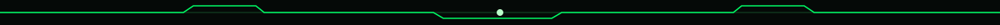
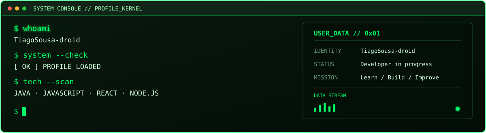
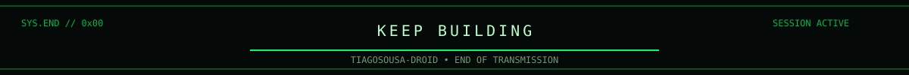

<div align="center">




<br/>


[](https://github.com/TiagoSousa-droid?tab=followers)
[](https://github.com/TiagoSousa-droid?tab=repositories)

</div>



## `// 01 — SYSTEM IDENTIFICATION`

<div align="center">

</div>

> Estudante de programação a desenvolver projetos práticos e a explorar tecnologias web, aplicações interativas e inteligência artificial.


## `// 02 — TECH STACK`

<div align="center">


<br/><br/>


</div>


## `// 03 — LIVE TELEMETRY`

<div align="center">


<br/><br/>


</div>


## `// 04 — PROJECT DATABASE`

<div align="center">

<a href="https://github.com/TiagoSousa-droid/CARANIMALINHO">

</a>
<a href="https://github.com/TiagoSousa-droid/TREMU-NA-OFICINA">

</a>

</div>

<details>
<summary><b>OPEN PROJECT FILES</b></summary>

- **CARANIMALINHO** — conceito de aplicação que associa expressões faciais a imagens de animais geradas por IA.
- **TREMU NA OFICINA** — jogo educativo e interativo centrado no reconhecimento de gestos através da câmara.
- [Explorar todos os repositórios](https://github.com/TiagoSousa-droid?tab=repositories)

</details>


## `// 05 — CONTRIBUTION RADAR`

<div align="center">


<br/><br/>


</div>


## `// 06 — NEXT MISSIONS`

```diff
+ [x] Java e JavaScript
+ [x] Criar projetos práticos
+ [x] Explorar aplicações web e interativas
! [~] Aprofundar React e Node.js
! [~] Melhorar testes e documentação
- [ ] Construir aplicações full stack mais completas
- [ ] Continuar a aprender e publicar projetos
```

<div align="center">


</div>
