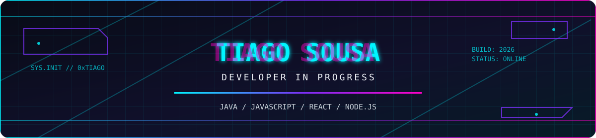
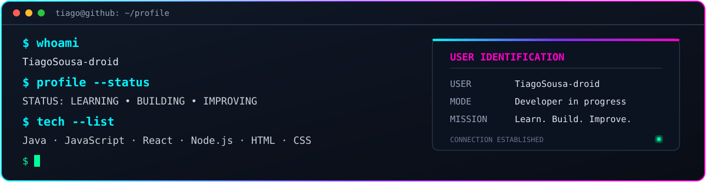

<div align="center">



<br/>

[](https://github.com/TiagoSousa-droid)

[](https://github.com/TiagoSousa-droid?tab=followers)
[](https://github.com/TiagoSousa-droid?tab=repositories)


</div>

<br/>

<div align="center">
  
</div>

<br/>

## ⚡ `STACK.tecnologica`

<div align="center">


</div>

<br/>

## 📡 `TELEMETRIA.github`

<div align="center">


<br/><br/>


</div>

<br/>

## 🧪 `PROJETOS.destaque`

<div align="center">

<a href="https://github.com/TiagoSousa-droid/TREMU-NA-OFICINA">
  
</a>
<a href="https://github.com/TiagoSousa-droid/CARANIMALINHO">
  
</a>

</div>

<details>
<summary><b>📂 Ver todos os meus repositórios</b></summary>

<br/>

Explora os meus projetos e experiências no GitHub:

- [Todos os repositórios](https://github.com/TiagoSousa-droid?tab=repositories)
- [TREMU NA OFICINA](https://github.com/TiagoSousa-droid/TREMU-NA-OFICINA)
- [CARANIMALINHO](https://github.com/TiagoSousa-droid/CARANIMALINHO)

</details>

<br/>

## 🏆 `CONQUISTAS`

<div align="center">


<br/><br/>


</div>

<br/>

## 🎯 `ROADMAP.2026`

```diff
+ [x] Explorar Java e JavaScript
+ [x] Criar projetos práticos para aprendizagem
+ [x] Trabalhar em aplicações web e interativas
! [~] Aprofundar React e Node.js
! [~] Melhorar a estrutura e documentação dos projetos
- [ ] Desenvolver aplicações full stack mais completas
- [ ] Aprender novas ferramentas de desenvolvimento
- [ ] Continuar a publicar projetos no GitHub
```

<br/>

## 📬 `CONTACTO`

<div align="center">

[](https://github.com/TiagoSousa-droid)

<br/>


</div>
